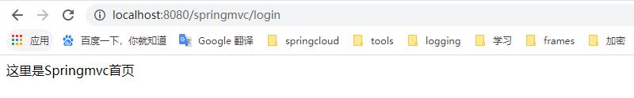

# SpringMVC

## 1、pom.xml引入坐标

```xml
<dependency>
    <groupId>org.springframework</groupId>
    <artifactId>spring-webmvc</artifactId>
    <version>5.2.5.RELEASE</version>
</dependency>
```

## 2、SpringMVC工作流程

### 2.1、DispatcherServlet的配置

```xml
<servlet>
    <servlet-name>dispatcher</servlet-name>
    <servlet-class>org.springframework.web.servlet.DispatcherServlet</servlet-class>
    <load-on-startup>1</load-on-startup>
</servlet>

<servlet-mapping>
    <servlet-name>dispatcher</servlet-name>
    <url-pattern>/</url-pattern>
</servlet-mapping>
```

### 2.2、DispatcherServlet实例化

Springmvc核心组件是DispatcherServlet（前端控制器），它是整个流程控制的核心，控制其他组件执行。相当于总指挥。启动应用加载web.xml时，就会创建调用DispatcherServlet的构造方法创建dispatcherServlet对象

```java
public DispatcherServlet() {
    // 给dispatchOptionsRequest赋值为true
    this.setDispatchOptionsRequest(true);
}
```

dispatcherServlet会实例化一系列Springmvc需要使用的组件：

```java
protected void initStrategies(ApplicationContext context) {
    initMultipartResolver(context);
    initLocaleResolver(context);
    initThemeResolver(context);
    initHandlerMappings(context);
    initHandlerAdapters(context);
    initHandlerExceptionResolvers(context);
    initRequestToViewNameTranslator(context);
    initViewResolvers(context);
    initFlashMapManager(context);
}
```

### 2.3、SpringMVC处理http请求


## 3、web.xml配置

```xml
<?xml version="1.0" encoding="UTF-8"?>
<web-app xmlns="http://xmlns.jcp.org/xml/ns/javaee"
         xmlns:xsi="http://www.w3.org/2001/XMLSchema-instance"
         xsi:schemaLocation="http://xmlns.jcp.org/xml/ns/javaee 
            http://xmlns.jcp.org/xml/ns/javaee/web-app_4_0.xsd"
         version="4.0">

    <!--
        web应用启动的时候，我们希望首先加载spring的配置文件
        在web.xml中配置context-param
    -->
    <context-param>
        <param-name>contextConfigLocation</param-name>
        <!--应用加载时加载的配置文件
			WEB-INF/dispatcher-servlet.xml文件是springmvc默认必需加载的文件
			如果有其他需要加载的文件，可以加在<param-value>中
		-->
        <param-value>WEB-INF/dispatcher-servlet.xml</param-value>
    </context-param>

    <listener>
        <listener-class>
            org.springframework.web.context.ContextLoaderListener
        </listener-class>
    </listener>

    <servlet>
        <servlet-name>dispatcher</servlet-name>
        <servlet-class>org.springframework.web.servlet.DispatcherServlet</servlet-class>
        <load-on-startup>1</load-on-startup>
    </servlet>

    <servlet-mapping>
        <servlet-name>dispatcher</servlet-name>
        <url-pattern>/*</url-pattern>
    </servlet-mapping>

</web-app>
```

## 4、SpringMVC配置

```xml
<?xml version="1.0" encoding="UTF-8"?>
<beans xmlns="http://www.springframework.org/schema/beans"
       xmlns:xsi="http://www.w3.org/2001/XMLSchema-instance"
       xmlns:context="http://www.springframework.org/schema/context"
       xmlns:mvc="http://www.springframework.org/schema/mvc"
       xsi:schemaLocation="http://www.springframework.org/schema/beans
        http://www.springframework.org/schema/beans/spring-beans.xsd
        http://www.springframework.org/schema/context
        https://www.springframework.org/schema/context/spring-context.xsd
        http://www.springframework.org/schema/mvc
        http://www.springframework.org/schema/mvc/spring-mvc.xsd">

    <!--开启注解驱动：配置了handlerMapping与handlerAdapter-->
    <mvc:annotation-driven/>
    <!--扫描需要加载的bean-->
    <context:component-scan base-package="com.skyline.springmvc.controller"/>
    
    <!--配置视图解析器-->
    <bean class="org.springframework.web.servlet.view.InternalResourceViewResolver">
        <property name="prefix" value="/"/>
        <property name="suffix" value=".jsp"/>
    </bean>

</beans>
```

## 5、handler开发

自定义一个handler：

```java
@Controller
public class TestController {

    @RequestMapping("/login")
    public String login() {
        System.out.println("Springmvc请求成功！");
        return "index";
    }
}
```

## 6、view开发

在应用根路径下创建index.jsp

```jsp
<%@ page contentType="text/html;charset=UTF-8" language="java" %>
<html>
<head>
    <title>Springmvc欢迎你</title>
</head>
<body>
这里是Springmvc首页
</body>
</html>
```

## 7、request请求



到这里，一个基于SpringMVC的基本web应用就完成了。

从上面可以看出，SpringMVC的框架已经给了我们大量的组件来进行web开发，开发者只需要根据业务需要开发handler及view就可以了。
